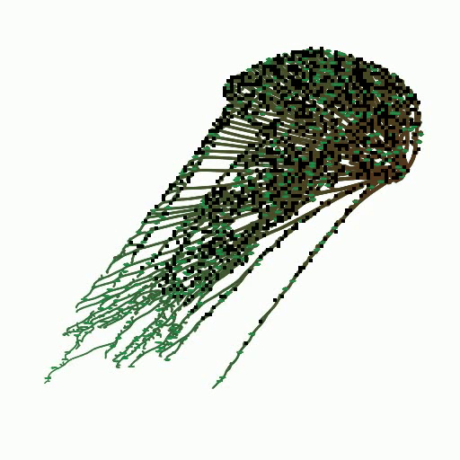
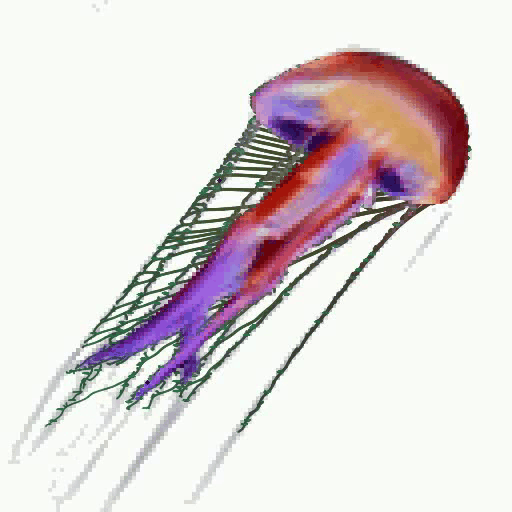

# Neural-Organic Growth Engine 🌿🧠✨

> A generative art pipeline combining **Space Colonization Algorithms** and **Neural Cellular Automata** to grow organic textures inside arbitrary shapes.

<p align="center">
  
  <br>
  <em>Target Shape</em>
</p>

This project implements a bio-mimetic pipeline that simulates natural growth processes. It starts with a tree-like skeleton (SCA), uses it to seed a neural growth process (NCA), and renders the result using fluid particle dynamics.

---

## 🎨 The Pipeline

### 1. Space Colonization Algorithm (SCA) 🌿
**"The Skeleton"**

We start by generating a branching structure inside your target image.
*   **Logic**: Simulates how veins or branches grow towards "nutrient" sources (attractors) scattered within the shape.
*   **Purpose**: Creates a biologically plausible "skeleton" and determines the optimal **seed positions** for the neural network to start growing.


### 2. Neural Cellular Automata (NCA) 🧠
**"The Flesh"**

A neural network learns to "grow" the target image texture starting from the seeds generated by the SCA.
*   **Logic**: Thousands of tiny cells communicate locally to self-organize into the global pattern.
*   **Purpose**: Provides the texture, color, and "living" dynamics of the image.



### 3. Particle Advection Refinement ✨
**"The Skin"**

We don't just display the pixels. We treat the NCA output as a **flow field**.
*   **Logic**: Thousands of particles are dropped onto the canvas and flow along the contours of the generated pattern.
*   **Purpose**: Transforms blocky pixel grids into smooth, high-resolution, organic curves.



---

## 🚀 Installation

1.  **Clone the repository**
    ```bash
    git clone https://github.com/yourusername/neural-organic-growth.git
    cd neural-organic-growth
    ```

2.  **Install dependencies**
    ```bash
    pip install -r requirements.txt
    ```

---

## 🛠️ Usage

**👉 Full reference: [docs/USAGE.md](docs/USAGE.md)** — every command, output path, and tuning parameter.

The pipeline is controlled by a single configuration file: `config/pipeline.py`.

### 1. Configure
Open `config/pipeline.py` and set your target image:
```python
# config/pipeline.py
@dataclass
class PipelineConfig:
    target_image: str = 'images/your_image.png'  # <--- Change this
    # ...
```
All output paths are derived from this filename, so this is the only path you need to set.

### 2. Generate Skeleton (SCA)
Run the Space Colonization Algorithm to create the tree and find seed points.
```bash
python train_sca.py
```
*   *Output*: `outputs/sca/` (Tree visualization, seed positions JSON)

### 3. Train Growth Model (NCA)
Train the Neural Cellular Automata to grow your image from the SCA seeds.
```bash
python train_nca.py
```
*   *Output*: `outputs/nca/` (Trained model .pt, training logs)

### 4. Render Final Animation
Generate the final high-quality video combining all steps.
```bash
python render.py --mode combined
```
*   *Output*: `outputs/rendering/<name>_full_pipeline.mp4` (plus the intermediate `_combined.mp4` and `_particles.mp4`)

Other modes render a single stage in isolation:

| Command | Renders | Output |
| --- | --- | --- |
| `python render.py --mode sca` | skeleton growth only | `<name>_sca.mp4` |
| `python render.py --mode nca` | texture growth only (centre seed) | `<name>_nca.mp4` |
| `python render.py --mode particles` | particle pass over existing NCA frames | `<name>_particles.mp4` |
| `python render.py --mode combined` | the whole pipeline | `<name>_full_pipeline.mp4` |

To tweak particle parameters without regenerating the NCA frames:
```bash
python run_particles.py
```

---

## 📂 Project Structure

*   `config/`: Centralized configuration for all algorithms.
*   `sca/`: Space Colonization Algorithm logic (Tree, Branch, Attractor).
*   `nca/`: Neural Cellular Automata model and training loop (PyTorch).
*   `particles/`: Particle advection and flow field rendering.
*   `rendering/`: Animation engines and exporters.
*   `tools/`: Helper scripts (RGBA image painter, video splitter for docs assets).
*   `docs/`: [Usage guide](docs/USAGE.md) and detailed explanations of the math and biology behind the code.

---

## 🧪 Examples

Here is the standard workflow to run the "Brini" example included in the repo:

```bash
# 1. Create the vein structure
python train_sca.py

# 2. Learn the texture growth
python train_nca.py

# 3. Render the particle animation
python render.py --mode particles

# OR: Render the full growth process (SCA -> NCA -> Particles)
python render.py --mode combined
```

---

## 📚 References & Inspiration

This project is heavily inspired by the groundbreaking work on differentiable self-organizing systems:

*   **[Growing Neural Cellular Automata](https://distill.pub/2020/growing-ca/)** (Mordvintsev et al., Distill, 2020) - The primary source for the NCA implementation.

